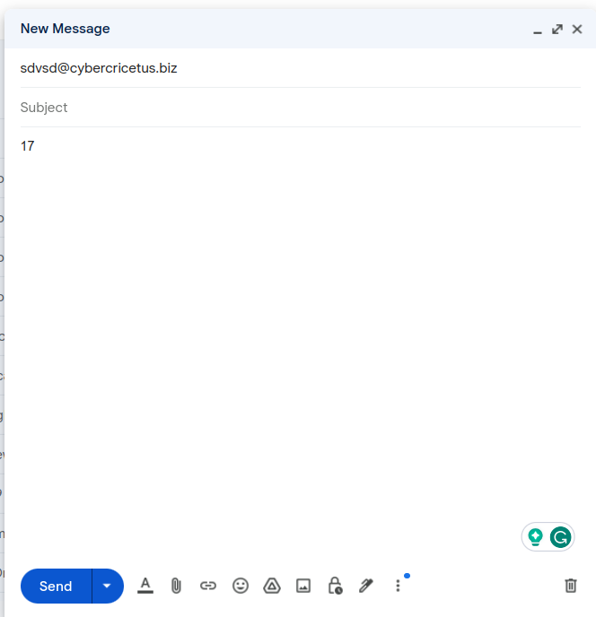
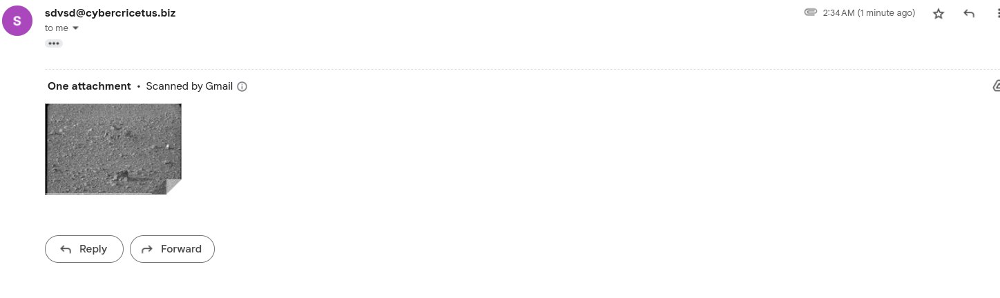

## MLH GLOBAL HACK WEEK PRJ
  This program receives emails from users and uses the email-sending service provided by SendGrid to send back a picture of the Mars rover from NASA.      

              
**Method to Use**    
1. Download the code and install all packages if needed  
2. Run `sender.py`
3. Run `ngrok http 5000` at terminal
4. Go to `https://app.sendgrid.com/settings/parse`
5. Click on the "Add HOST & URL" button
6. Copy and paste the link shown in the terminal and type `\email` after the link; select your domain, and leave the black before the domain blank
7. Go to the administration website of your domain and add an MX record. Leave the "Host" field blank and fill the "Point to" field with:
`mx.sendgrid.net.`
8. Send an email with a number (other things if you want) to [any string]@[your domain] as Sendgrid will check all domain names ending with [your domain].     
**Note that make sure your Sendgrid account has been configured and so has your domain**           
For more info about configuring the account configuration, please read the following document:     
`https://www.twilio.com/blog/how-to-set-up-domain-authentication-for-twilio-sendgrid`

         
**Thought on Implementation**    
There are two functions in the `API_Sending.py` file. The `mailSender` is for sending the email back to the querier, and the `getPic` is for downloading the NASA picture.        
The `sender.py` file is the main loop. It is responsible for listening to any query emails.    
Normally, the query emails contain a number that indicates the number of Martian Solar Days after the Curiosity had landed. If there is not a valid number, then the `getPic` function will produce a random number as the number.     
When a new email is received, the `email_response` function will read the sender of the query email. Then, this address plus the valid number (if any) will be passed to the `mailSender` function (if the number is not valid, -1 will    
be sent to inform the `getPic` function to select a solar day randomly. The `getPic` function will download the first picture among all pictures with the query solar day, and the `mailSender` will send the picture to the querier.  
To save space, after the picture is sent, it will be deleted immediately.    

              
**Examples of Using**  
* Send the message:     
      
* Result:
  
